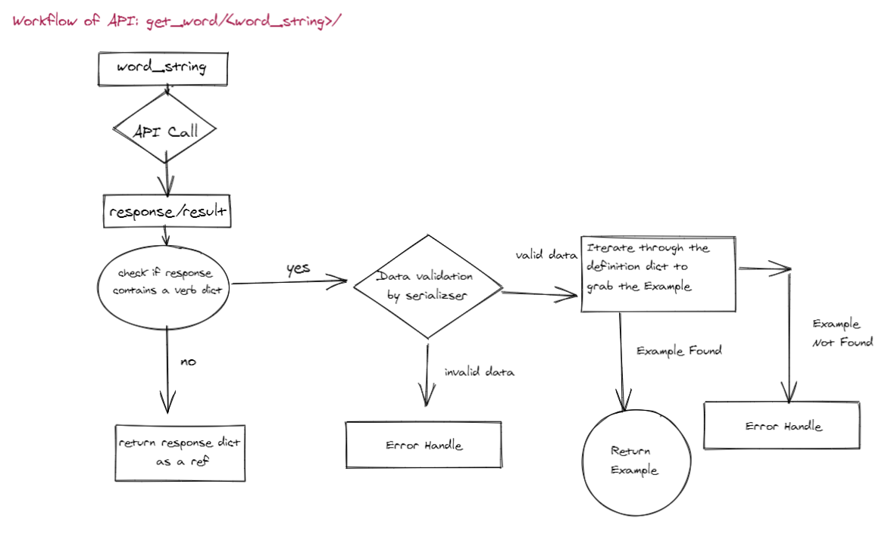

## Valital Django Backend

This project is providing simple endpoints to play with words, using the https://dictionaryapi.dev/ API.

## Technologies

Project is created with:

- Django version: 4.1.4
- Nginx unit docker image version: 1.29.0-python3.11

## Setup

To run this project, install docker in your system first. Then follow this step:

```
$ git clone https://github.com/ashrakrahman/valital-django-backend.git
$ cd valital-django-backend
$ ./deploy.sh

```

Wait few moments to build the project in your machine. Then start the project by using following url:

```
$ http://127.0.0.1:8000/

```

You will find a swagger ui to access the APIs. Sample image follows:


<!-- Architecture Diagram -->

## Architecture Diagram


<!-- API Work flow -->

## API Work flow



<!-- CONTACT -->

## Contact

Ashrak Rahman Lipu - [@linkedin](https://www.linkedin.com/in/ashrakrahman/) - ashrakrahman@gmail.com
